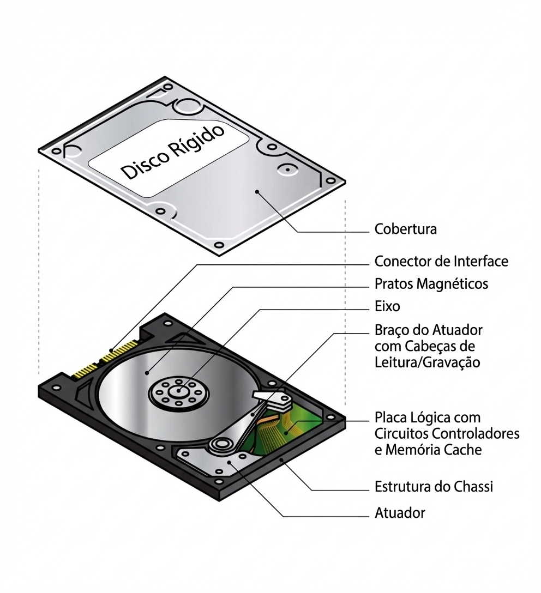
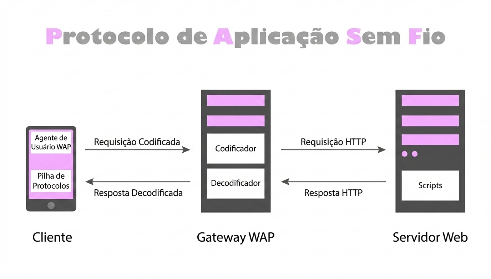

# ASP.Net Minimal API – Estrutura Completa (C# .NET)

Este projeto é uma **Minimal API em .NET**, organizada seguindo boas práticas de **Domain-Driven Design (DDD)**, **injeção de dependência**, **separação de camadas**, **validações**, além de conter um **projeto de testes unitários**.


---

## 📌 Tecnologias Utilizadas

- **.NET 9**
- **Minimal API**
- **Entity Framework Core**
- **MySQL** (configurável)
- **AutoMapper**
- **FluentValidation**
- **JWT Authentication**
- **xUnit** (Testes)
- **Moq** (mocks nos testes)

---

## 📁 Estrutura do Projeto

```plaintext

Minimal-API/
│── API/ # Projeto principal da API
│ ├── Dominio/ # Regras de negócio
│ │ ├── DTOs/
│ │ ├── Entidades/
│ │ ├── Interfaces/
│ │ └── Servicos/
│ │
│ ├── Infraestrutura/ # Persistência e infraestrutura
│ │ ├── Contexto/
│ │ ├── Mapeamentos/
│ │ ├── Migracoes/
│ │ ├── Repositorios/
│ │ └── Utils/
│ │
│ ├── Rotas/ # Endpoints da API
│ ├── appsettings.json
│ ├── Program.cs
│ └── Startup.cs
│
├── Test/ # Projeto de testes
│ ├── Domain/
│ ├── Helpers/
│ ├── Mocks/
│ └── Requests/
│
└── Minimal-API.sln


```

## Configuração via appsettings.json
```json
{
  "ConnectionStrings": {
    "ConexaoPadrao": "server=localhost;port=3306;user= 'SEU USUARIO' ;password= 'SUA SENHA' ;database=minimalApi"
  },
  "Jwt": {
    "Key": "minimal-api-jwt"
  }
}
```

## 🚀 Como Executar o Projeto

### 1. Restaurar pacotes

```bash
dotnet restore
```
### 2. Aplicar migrações do banco

```bash
dotnet ef database update --project API
```

### 3. Rodar a API

```bash
dotnet run --project API
```

A API iniciará em:

```arduino
https://localhost:7094
http://localhost:5135
```

## Autenticação

O sistema usa **JWT** para autenticação.

**Endpoint de login**
```bash
POST /login
```

Exemplo:
```json
{
  "email": "admin@teste.com",
  "senha": "123456"
}
```

## Testes Automatizados

Para executar os testes:
```bash
dotnet test
```
Os testes cobrem:

- Serviços de domínio
- Validações
- Requisições
- Mocks de repositórios

## Principais Features

- Cadastro e autenticação de administradores
- Gerenciamento de veículos
- Serviços e regras de domínio bem organizados
- Repositórios utilizando EF Core
- Estrutura limpa e escalável
- Testes unitários bem distribuídos

## Estrutura de Rotas (Resumo)

- **/login** → autenticação JWT
- **/administradores** → CRUD de administradores
- **/veiculos** → CRUD de veículos

## TESTE

Este projeto aplica três pilares essenciais do desenvolvimento moderno:

### 🧪 1. Testes de Unidade (Unit Tests)

**O que é:**
É um teste automatizado que verifica a menor "unidade" de código (geralmente um método) de forma **isolada** do resto do sistema.

> **🏎️ Analogia:** Pense em testar o motor de um carro. Em vez de testar o carro inteiro na rua (teste de integração), você coloca apenas o motor em uma bancada para garantir que ele liga, acelera e para, sem depender das rodas ou da direção.

**Como se aplica neste projeto:**
* **A Unidade:** `AdministradorServico.cs`
* **O Teste:** `AdministradorServicoTest.cs`
* **O Isolamento:** O teste não acessa o banco de dados MySQL real (o que seria lento). Ele utiliza um banco em memória ou mocks para testar exclusivamente a regra de negócio.
* **Objetivo:** Garantir que o método de Login retorne o administrador correto ou erro, sem depender de fatores externos.

---

### 💾 2. Persistência de Dados

**O que é:**
É o ato de salvar dados em um local "não volátil" (como o HD ou SSD), garantindo que eles não desapareçam quando a aplicação for fechada.

> **📝 Analogia:**
> * **Memória RAM:** Uma lousa branca. Rápida para escrever, mas se apaga facilmente ao desligar.
> * **Persistência (Banco):** Um caderno de pedra. Demora um pouco mais para escrever, mas a informação permanece intacta para sempre.



**Como se aplica neste projeto:**
* **Ferramenta:** Banco de dados **MySQL**.
* **Gerenciador:** O `DbContexto.cs` (Entity Framework Core) gerencia como os objetos C# (ex: `Administrador`) são convertidos e salvos nas tabelas do banco.
* **Backup:** O uso de ferramentas como `mysqldump` garante a segurança desses dados persistidos.

---

### 📬 3. Request (Requisição)

**O que é:**
É o pedido que um cliente (navegador, app ou Postman) faz ao servidor. É a base da comunicação na Web.

> **🍔 Analogia:** É como fazer um pedido em um restaurante:
> 1.  **Cliente (Você):** Faz o pedido.
> 2.  **Request:** "Quero um hambúrguer" (Verbo POST + Dados).
> 3.  **Servidor (Cozinha):** Processa o pedido.
> 4.  **Response:** O garçom traz o hambúrguer (Dados + Status 200 OK).



**Como se aplica neste projeto:**
* **Cliente:** O **Postman** (ou Front-end).
* **Servidor:** A **Minimal API** (`Program.cs`).
* **Request:** O envio de um JSON com email e senha para a rota `.../login`.
* **Processamento:** O endpoint `app.MapPost("/login")` recebe o pedido, chama o serviço e devolve uma **Response** (Sucesso ou Falha).

## Notas do Autor

Este projeto demonstra uma arquitetura simples porém sólida, aplicando conceitos de **DDD**, separação de camadas e testabilidade.